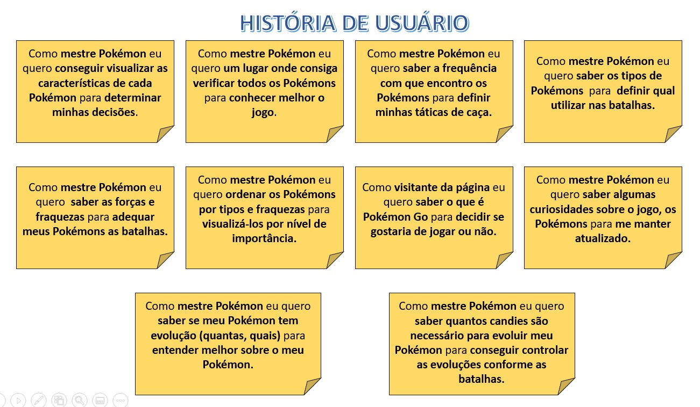

# Data Lovers - Pokémon
## Pokémon LIK

***

### Índice

* [1. Introdução](#1-introdução)
* [2. Histórias de Usuário](#2-histórias-de-usuários)
  * [ProtoPersona](#protopersona)
  * [Protótipo de Baixa Fidelidade](#protótipo-de-baixa-fidelidade)
* [3. Pokémon LIK](#3-pokémon-lik)
* [4. Teste de Usabilidade](#4-teste-de-usabilidade)
* [5. Colocando a mão na massa](#5-colocando-a-mao-na-massa)
* [6. Considerações Finais](#6-considerações-finais)

***

### 1. Introdução
Desenvolvido para a sugunda etapa do Bootcamp da [Laboratória Brasil](https://www.laboratoria.la/br), com o objetivo de manipular dados onde os mesmos se convertam em **informação** fazendo com que os usuários consigam visualizar o que estão buscando.

Para esse projeto tinhamos uma série de dados (temas) diferentes em que poderíamos escolher com que tipo de dados gostaríamos de trabalhar.

A partir da escolha dos dados iniciamos o projeto, nosso projeto é voltado para usuários que jogam ou desejam conhecer o jogo **Pokémon Go**.

A seguir falaremos mais sobre o assunto.

***

### 2. Histórias de Usuário

A partir da definicação do tema do projeto iniciamos o mesmo buscando entender melhor quem seria os nossos usuários, suas histórias e ProtoPersonas para assim iniciar o desenvolvimento do prototipo.

Definimos que a nossa aplicação seria desenvolvida para pessoas que gostariam de iniciar a jogar o jogo Pokémon Go, e também pessoas que já jogam o mesmo e necessitam de informações específicas de seus Pokémons.

Com isso chegamos em nossas histórias de usuários, nem todas achamos interessante colocar em prática no projeto, porém documentamos todas:

#### *ProtoPersona*

Toda a aplicação foi desenvolvida com base em nossas duas ProtoPersonas abaixo:

* *ProtoPersona 1 - Caio*

* *ProtoPersona 2 - Rosana*

#### *Protótipo de Baixa Fidelidade*

***
### 3. Pokémon LIK

O objetivo principal deste projeto é que aprenda a desenhar e construir uma
interface web onde se possa visualizar e manipular dados, entendendo o que o
usuário necessita.

## 4. Considerações gerais

* Este projeto será executado em duplas.
* Este projeto será entregue através do GitHub e a interface deve ser publicada
  no [GitHub Pages](https://pages.github.com/).
* Tempo para completá-lo: 3 semanas.

## 5. Critérios mínimos de aceitação do projeto

Os critérios considerados para que tenha terminado este projeto são:

### Definição de produto

Documente brevemente seu trabalho no arquivo `README.md` de seu repositório,
contando como foi o processo de desenho e como você acredita que o produto possa
resolver o problema (ou problemas) de seu usuário.

### Desenho de interface do usuário

#### Protótipo de baixa fidelidade

Durante seu trabalho você deverá fazer e iterar rascunhos de sua solução usando
lápis e papel. Recomendamos que fotografe todas as iterações que fizer, suba
para seu repositório e as mencione no `README.md`.

#### Testes de usabilidade

Durante o desafio você deverá fazer testes de usabilidade com usuários
diferentes, e com base nos resultados desses testes, iterar seus desenhos de
interface. Conte-nos quais problemas de usabilidade você detectou através dos
testes e como os resolveu na proposta final.

### Implementação da interface de usuário (HTML/CSS/JS)

Após desenhar sua interface de usuário, deverá trabalhar na sua implementação.
**Não** é necessário que construa a interface exatamente da mesma forma que
desenhou. Terá um tempo limitado para trabalhar no projeto, então você deve
priorizar as tarefas.

No mínimo, sua implementação deverá:

1. Mostrar os dados em uma interface: pode ser em cards, tabelas, listas, etc.
2. Permitir ao usuário interagir com a interface para obter as informações que
   necessita;
3. Ser _responsiva_, ou seja, deve ser visualizada sem problemas a partir de
   diversos tamanhos de tela: celulares, tablets, notebooks, etc.

### Testes unitários

O _boilerplate_ do projeto não inclui testes unitários. Assim, você terá que
escrever seus próprios testes para as funções encarregadas de _processar_,
_filtrar_ e _ordenar_ os dados, assim como _calcular_ estatísticas.

Seus testes unitários devem ter cobertura mínima de 70% de _statements_
(_sentenças_), _functions_ (_funções_), _lines_ (_linhas_), e _branches_
(_ramos_) do arquivo `src/data.js`, que irá conter suas funções e que está
detalhado na seção de [Considerações técnicas](#srcdatajs).

## 6. Hacker edition

***

## 9. Checklist

* [ ] Usar VanillaJS.
* [ ] Não utilizar `this`.
* [ ] Passa pelo linter (`npm run pretest`)
* [ ] Passa pelos testes (`npm test`)
* [ ] Testes unitários cobrem um mínimo de 70% de statements, functions, lines e
  branches.
* [ ] Inclui uma _definição de produto_ clara e informativa no `README.md`.
* [ ] Inclui histórias de usuário no `README.md`.
* [ ] Inclui rascunho da solução (protótipo de baixa fidelidade) no `README.md`.
* [ ] Inclui uma lista de problemas detectados nos testes de usabilidade no
  `README.md`.
* [ ] UI: Mostra lista/tabela/etc com dados e/ou indicadores.
* [ ] UI: Permite ordenar dados por um ou mais campos (asc e desc).
* [ ] UI: Permite filtrar dados com base em uma condição.
* [ ] UI: É _responsivo_.
